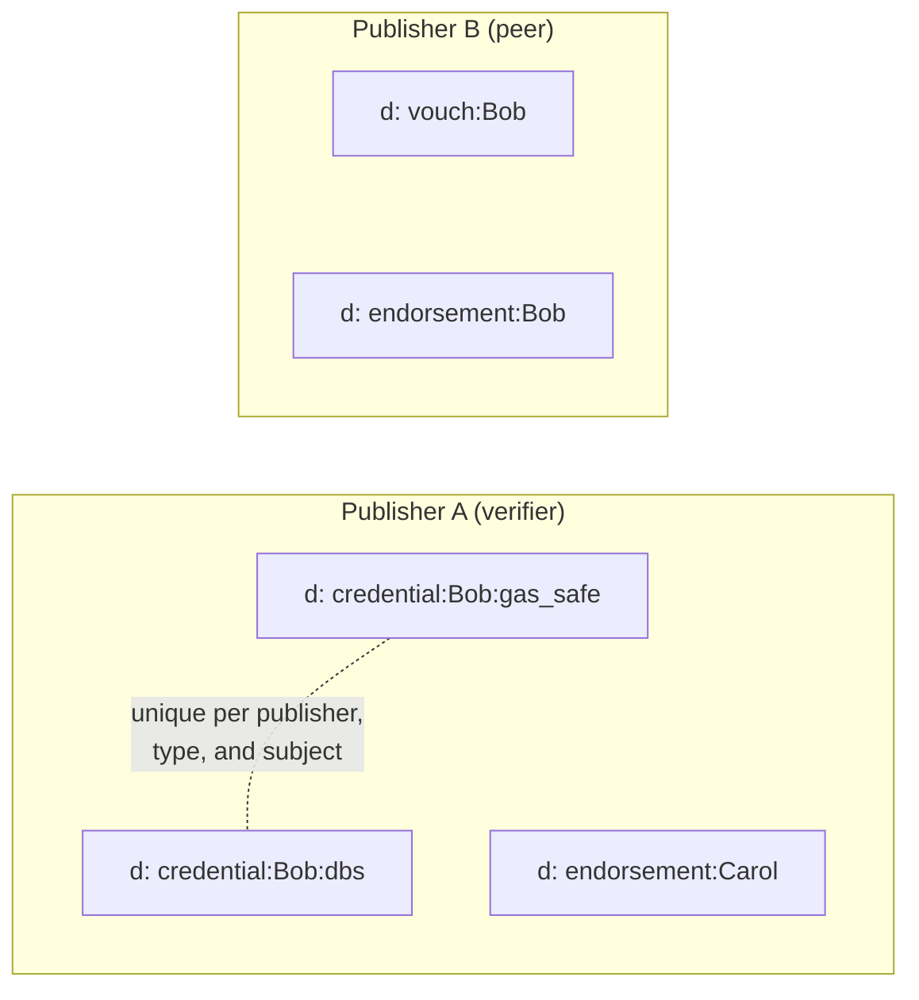
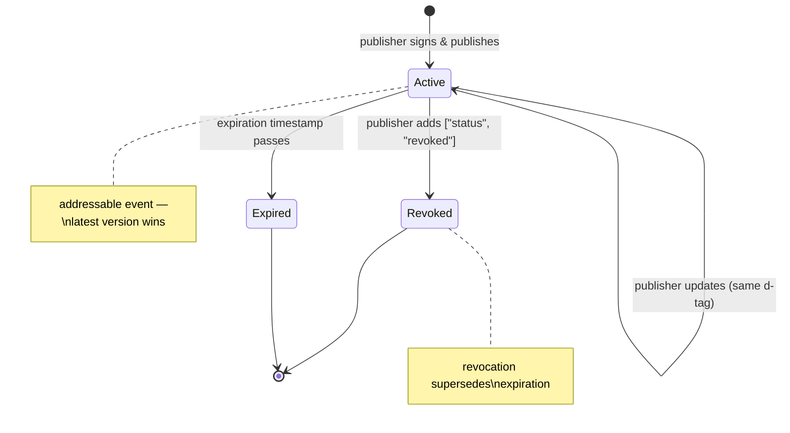
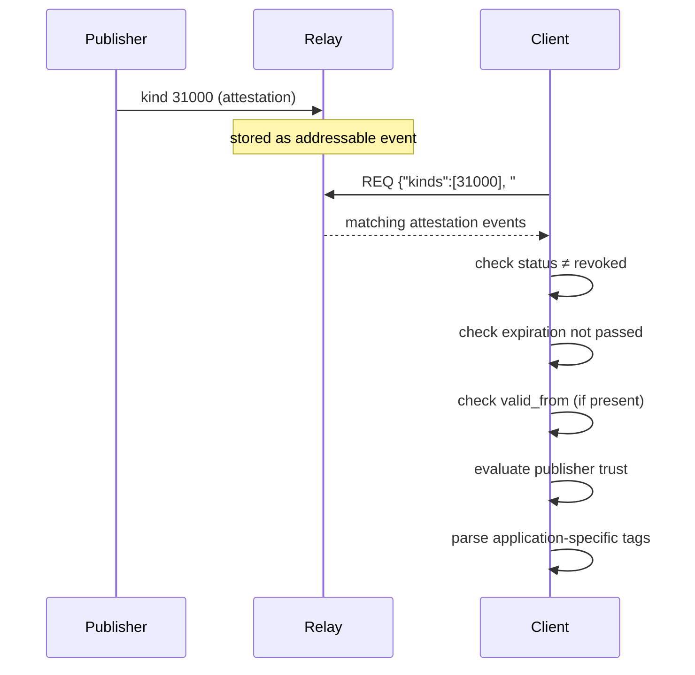
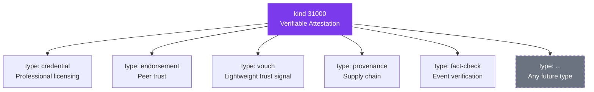

NIP-VA
======

Verifiable Attestations
-----------------------

`draft` `optional`

This NIP defines a single addressable event kind for structured, typed attestations between Nostr identities. It provides a generic foundation for credentials, endorsements, vouches, revocations, and any other attestation type -- differentiated by a `type` tag rather than separate event kinds.

Motivation
----------

Several independent protocols on Nostr have converged on the same structural pattern: an addressable event where one pubkey makes a signed, typed claim about another pubkey (or about itself). Each protocol currently invents its own event kind, leading to kind proliferation and missed interoperability.

Existing NIPs partially address this space but leave significant gaps:

- [NIP-58](58.md) (Badges) is display-oriented. Badges carry no structured claims, no expiration, no revocation mechanism, and no support for cryptographic proofs. They are designed for profile decoration, not verifiable assertions.
- [NIP-85](85.md) (Trusted Assertions) covers social graph metrics (follower counts, rankings, zap volumes). It is not designed for arbitrary typed claims between identities.
- [NIP-32](32.md) (Labeling) provides lightweight, non-addressable labels. Labels lack built-in expiration, are not individually replaceable per subject, and carry no convention for structured attestation data.

A single generic attestation kind allows identity verification protocols, professional licensing systems, product provenance tracking, peer endorsement networks, and trust management systems to share a common event structure while defining their own application-specific semantics through the `type` tag.

Specification
-------------

### Event Kind

Kind `31000` (Verifiable Attestation) -- an addressable event per [NIP-01](01.md).

### Tags

#### Required

| Tag    | Value                         | Description                                                        |
| ------ | ----------------------------- | ------------------------------------------------------------------ |
| `d`    | `<type>:<identifier>` or `assertion:<ref>` | Addressable identifier (see [d-tag convention](#d-tag-convention))  |

At least one of `type` or an assertion reference (`e`/`a` tag with `"assertion"` marker) MUST be present:

| Tag    | Value                  | Condition                                                          |
| ------ | ---------------------- | ------------------------------------------------------------------ |
| `type` | `<attestation-type>`   | REQUIRED when no assertion reference is present. OPTIONAL when an assertion reference is present (type can be inferred from the referenced event). |

#### Conditionally Required

| Tag | Value              | Condition                                                                                                                                     |
| --- | ------------------ | --------------------------------------------------------------------------------------------------------------------------------------------- |
| `p` | `<subject-pubkey>` | REQUIRED when the attestation is about a third party. SHOULD be omitted for self-attestations (e.g. self-declaration, service registration). |

#### Recommended

| Tag          | Value                   | Description                                                             |
| ------------ | ----------------------- | ----------------------------------------------------------------------- |
| `expiration` | `<unix-timestamp>`      | Attestation expiry per [NIP-40](40.md)                                  |
| `summary`    | `<human-readable text>` | Brief description for clients that do not understand the `type`         |

#### Optional

| Tag          | Value                    | Description                                                              |
| ------------ | ------------------------ | ------------------------------------------------------------------------ |
| `valid_from` | `<unix-timestamp>`       | Earliest time the attestation is valid (deferred activation)             |
| `valid_to`   | `<unix-timestamp>`       | Latest time the attestation's claim is valid (validity window end)       |
| `request`    | `<opaque-string>`        | Reference to the event that prompted this attestation                    |
| `schema`     | `<uri>`                  | Machine-readable schema reference for regulatory mapping or profile ID   |
| `e`          | `<event-id>`, `<relay>`, `"assertion"` | Reference to a first-person assertion event being attested       |
| `a`          | `<coordinate>`, `<relay>`, `"assertion"` | Reference to an addressable assertion event being attested     |
| `L`          | `<namespace>`            | Label namespace per [NIP-32](32.md)                                      |
| `l`          | `<label>`, `<namespace>` | Label value per [NIP-32](32.md)                                          |

**Validity window:** When `valid_from` is present, clients SHOULD treat the attestation as inactive before that timestamp. When `valid_to` is present, clients SHOULD treat the attestation's claim as no longer valid after that timestamp. Note that `valid_to` is distinct from `expiration` (NIP-40): `expiration` tells relays when to garbage-collect the event, while `valid_to` tells applications when the claim stops being valid. An attestation can remain on relays after `valid_to` for historical reference.

**Assertion references:** An attestation MAY reference a first-person assertion event -- the subject's own claim that the attestor is verifying. At most one `e` or `a` tag with the `"assertion"` marker is allowed per attestation (never both). When present, the attestation means "I attest to the validity of this claim." When the `type` tag is absent, the type is inferred from the referenced assertion event.

Applications MAY define additional tags specific to their attestation types. Such tags are carried on the event alongside the tags defined here.

### Content

The `content` field is application-defined. It MAY be:

- Empty (when the attestation is fully expressed through tags)
- Human-readable text (a written statement or summary)
- Structured data such as JSON (cryptographic proofs, evidence payloads, or other machine-readable content)

Clients that do not understand a particular attestation type SHOULD fall back to displaying the `summary` tag if present.

### d-tag Convention

The `d` tag follows one of two formats:

**Typed attestation:** `<type>:<identifier>`
- `<type>` matches the value of the `type` tag. Type values MUST NOT contain colons. The first colon in the `d` tag is the delimiter.
- `<identifier>` is a context string relevant to the attestation -- typically the subject's hex pubkey for third-party attestations, or an application-defined context string for self-attestations.

**Assertion-only attestation:** `assertion:<ref>`
- Used when no `type` tag is present (assertion-first pattern).
- `<ref>` is the event ID (for `e`-tag assertions) or addressable coordinate (for `a`-tag assertions).

This convention ensures:

1. **One attestation per publisher per type per subject.** Addressable semantics ([NIP-01](01.md)) mean that a publisher's latest attestation of a given type for a given subject supersedes all prior versions.
2. **Relay-side filtering.** Clients can query by `d` tag prefix to retrieve all attestations of a particular type.
3. **No collisions.** Different attestation types from the same publisher occupy distinct `d` tag slots.



### Revocation

To revoke a previously issued attestation, the publisher replaces the original event with an updated version that includes a `["status", "revoked"]` tag. Because addressable events are replaceable, the revocation supersedes the original.

The `status` tag is used exclusively for lifecycle state on kind `31000` events. The only defined value is `revoked`. Applications MUST NOT define additional `status` values on kind `31000` events without a subsequent NIP.

#### Revocation Tags

| Tag         | Value              | Required | Description                                           |
| ----------- | ------------------ | -------- | ----------------------------------------------------- |
| `status`    | `revoked`          | Yes      | Signals this attestation has been revoked             |
| `reason`    | `<human-readable>` | No       | Why the attestation was revoked                       |
| `effective` | `<unix-timestamp>` | No       | When the revocation takes effect (may differ from `created_at`) |

Example: to revoke a credential previously issued with `d` tag `credential:<subject-pubkey>`, the publisher re-publishes:

```json
{
  "kind": 31000,
  "pubkey": "<verifier-pubkey>",
  "tags": [
    ["d", "credential:<subject-pubkey>"],
    ["type", "credential"],
    ["p", "<subject-pubkey>"],
    ["status", "revoked"],
    ["reason", "license-expired"],
    ["effective", "1704067200"],
    ["summary", "Credential revoked: license expired"]
  ],
  "content": ""
}
```

Clients MUST check for the `status` tag with value `revoked` before treating any attestation as valid. If an `effective` tag is present, clients SHOULD treat the attestation as valid before that timestamp and revoked after it.

### Attestation Lifecycle



### Verification Flow



Examples
--------

### Third-party attestation (credential)

A verifier attests that a subject holds a professional credential:

```json
{
  "kind": 31000,
  "pubkey": "<verifier-pubkey>",
  "tags": [
    ["d", "credential:<subject-pubkey>"],
    ["type", "credential"],
    ["p", "<subject-pubkey>"],
    ["expiration", "1735689600"],
    ["summary", "Professional credential verified"],
    ["profession", "attorney"],
    ["jurisdiction", "US-NY"]
  ],
  "content": "{\"proof\": \"...\"}"
}
```

### Self-attestation (service registration)

A pubkey declares itself as a verification service provider:

```json
{
  "kind": 31000,
  "pubkey": "<verifier-pubkey>",
  "tags": [
    ["d", "verifier:notary"],
    ["type", "verifier"],
    ["summary", "Identity verification service"],
    ["profession", "notary"],
    ["jurisdiction", "US-CA"]
  ],
  "content": ""
}
```

### Endorsement

One identity endorses another based on direct experience:

```json
{
  "kind": 31000,
  "pubkey": "<endorser-pubkey>",
  "tags": [
    ["d", "endorsement:<subject-pubkey>"],
    ["type", "endorsement"],
    ["p", "<subject-pubkey>"],
    ["summary", "Reliable provider, completed 12 transactions"],
    ["context", "plumbing"],
    ["confidence", "high"]
  ],
  "content": ""
}
```

### Provenance attestation

A certifier attests to the authenticity of a product:

```json
{
  "kind": 31000,
  "pubkey": "<certifier-pubkey>",
  "tags": [
    ["d", "provenance:<product-event-id>"],
    ["type", "provenance"],
    ["e", "<product-event-id>"],
    ["summary", "Authenticity verified: batch 2024-Q3"],
    ["origin", "Sheffield, UK"],
    ["method", "physical-inspection"]
  ],
  "content": "{\"chain_of_custody\": [...]}"
}
```

Application Profiles
--------------------

The attestation kind is intentionally minimal. One kind serves the full range of attestation use cases:



Application-specific semantics are defined by profiles that specify:

- Which `type` values they use
- Which additional tags they carry
- What the `content` field contains
- How clients should interpret and display the attestation

Profiles are expected to be documented by their respective applications. The following examples illustrate the range of use cases a single attestation kind can serve.

### Identity Verification

A verification system uses 6 attestation types to manage the full lifecycle of identity credentials. Revocation is handled via the `status: revoked` mechanism rather than a separate type:

| Type              | Subject (`p` tag) | Content                                        |
| ----------------- | ----------------- | ---------------------------------------------- |
| `credential`      | verified identity | Cryptographic proofs (ring signatures, range proofs) or empty |
| `vouch`           | vouched identity  | Empty                                          |
| `verifier`        | omitted (self)    | Optional professional statement                |
| `challenge`       | challenged party  | Evidence payload                               |
| `identity-bridge` | omitted (self)    | Proof linking multiple identities              |
| `delegation`      | delegate          | Empty                                          |

Revocation of any of these attestation types is performed by re-publishing with `["status", "revoked"]` and an optional `reason` tag. Application-specific tags: `tier`, `scope`, `method`, `profession`, `jurisdiction`, `age-range`.

### Professional Licensing

A licensing authority attests that practitioners hold valid regulatory credentials:

| Type         | Subject (`p` tag)    | Content                    |
| ------------ | -------------------- | -------------------------- |
| `credential` | licensed practitioner | Structured credential data |

Application-specific tags: `credential_type`, `credential_name`, `issuer_type`, `jurisdiction`, `verification_url`.

### Product Provenance

A supply chain system tracks authenticity and chain of custody:

| Type         | Subject (`p` tag) | Content               |
| ------------ | ----------------- | --------------------- |
| `provenance` | product publisher | Verification evidence |

Application-specific tags: `product`, `batch`, `origin`, `certifier`, `method`.

### Peer Endorsement

A trust network enables bilateral endorsements between participants:

| Type          | Subject (`p` tag) | Content |
| ------------- | ----------------- | ------- |
| `endorsement` | endorsed identity | Empty   |

Application-specific tags: `context`, `rating`, `confidence`.

### Event Verification

A fact-checking service attests to the accuracy of claims in Nostr events:

| Type         | Subject (`p` tag) | Content               |
| ------------ | ----------------- | --------------------- |
| `fact-check` | event publisher   | Verification evidence |

The `e` tag references the event being verified. Application-specific tags: `verdict`, `confidence`, `methodology`.

NIP-32 Interoperability
-----------------------

Publishers SHOULD emit [NIP-32](32.md) label events (kind `1985`) alongside attestation events. This enables clients that do not understand kind `31000` to discover and display basic attestation metadata through the standard labeling mechanism.

Example label accompanying an identity verification credential:

```json
{
  "kind": 1985,
  "tags": [
    ["L", "example.com/identity"],
    ["l", "verified", "example.com/identity"],
    ["p", "<subject-pubkey>"]
  ],
  "content": ""
}
```

The label namespace and vocabulary are application-defined. The NIP-32 event serves as a discoverability bridge, not as the authoritative attestation.

Relay Queries
-------------

### Fetch all attestations about a subject

```json
{"kinds": [31000], "#p": ["<subject-pubkey>"]}
```

### Fetch all attestations by a specific issuer

```json
{"kinds": [31000], "authors": ["<issuer-pubkey>"]}
```

### Fetch a specific attestation (for revocation checking)

```json
{"kinds": [31000], "authors": ["<issuer-pubkey>"], "#d": ["credential:<subject-pubkey>"]}
```

### Fetch all attestations about a subject from a specific issuer

```json
{"kinds": [31000], "authors": ["<issuer-pubkey>"], "#p": ["<subject-pubkey>"]}
```

Type Values
-----------

Type values are application-defined strings. Applications SHOULD choose descriptive, unambiguous type names. Collision between applications using the same type value with different semantics is possible; applications SHOULD use application-specific tags alongside the `type` tag to disambiguate when needed.

Well-known type values (informational, not normative):

| Type          | Typical use                                        |
| ------------- | -------------------------------------------------- |
| `credential`  | Third-party verification of qualifications         |
| `endorsement` | Peer recommendation based on direct experience     |
| `vouch`       | Lightweight trust signal                           |
| `verifier`    | Self-declaration of verification service status    |
| `provenance`  | Authenticity or chain-of-custody claim             |

Applications are encouraged to document their type conventions so that other clients can interoperate.

Relationship to Kind 31871
--------------------------

A separate proposal defines kinds `31871`, `31872`, `31873`, and `11871` for attestations with a built-in request/payment workflow and state machine. This NIP covers the same problem space with a different philosophy:

- **One kind, many types.** The four concepts in that proposal -- attestation, request, recommendation, proficiency -- map to four `type` values on a single kind. New attestation types require no protocol changes and no new kind numbers.
- **Both identity and event attestations.** Kind `31000` is not limited to identity claims. The `e` and `a` tags allow attestations about events (e.g. fact-checking, content verification) alongside attestations about pubkeys (credentials, endorsements). The `type` tag distinguishes the use case.
- **No state machine.** Addressable event semantics handle updates and revocations natively. Request/response workflows, payment integration, and multi-step state machines are application-level concerns that can be built on top of the attestation primitive without protocol-level kinds.
- **Application profiles over protocol roles.** Rather than defining attestor/requestor/recommender as protocol-level concepts with dedicated kinds, this NIP lets applications define their own roles through type conventions.

Security Considerations
-----------------------

### Attestation Forgery

Attestation events are signed by their publisher's Nostr keypair. Forgery requires compromising the publisher's private key. Clients SHOULD evaluate attestations in the context of the publisher's reputation and trust level, not treat any attestation as inherently authoritative.

### Replay Across Contexts

The `type` and `d` tag structure binds each attestation to a specific context. An attestation of type `credential` cannot be misinterpreted as an `endorsement` because the type is explicit and the `d` tag includes it. Applications that require additional context binding SHOULD add application-specific tags.

### Privacy

The `p` tag reveals which pubkey is the subject of an attestation. For attestations that require privacy (e.g. medical credentials, sensitive endorsements), publishers SHOULD use [NIP-59](59.md) gift wrapping to deliver attestations privately rather than publishing them to public relays.

### Third-party Revocation

The `status: revoked` mechanism is for **self-revocation** -- the original publisher withdraws their own attestation by re-publishing with the `status` tag. Third-party revocation -- where a party other than the original publisher asserts that an attestation should no longer be trusted -- is modeled as a separate attestation event (e.g. a new attestation with a type such as `challenge-result`), not as a replacement of the original event. Only the original publisher can replace their own addressable event.

### Revocation Timing

Clients MUST always fetch the latest version of an addressable event. For revocations, the `effective` tag (if present) indicates when the revocation takes effect, which may differ from the event's `created_at`. Clients SHOULD treat an attestation as invalid if a revocation with a matching `d` tag exists, even if the revocation's `created_at` is only slightly newer.

### Expiration and Revocation Precedence

An attestation that carries a `["status", "revoked"]` tag MUST be treated as invalid regardless of its `expiration` timestamp. Revocation is authoritative -- an attestation whose expiration date is still in the future but which has been revoked is not valid.

### Attestation Chain Depth

Applications that build chains of attestations (e.g. delegated credentials) SHOULD enforce a maximum chain depth and detect cycles to prevent denial-of-service through recursive verification.

Backwards Compatibility
-----------------------

This NIP introduces a new event kind. No existing events are affected. Clients that do not understand kind `31000` will ignore these events per [NIP-01](01.md) semantics.

Implementation Evidence
-----------------------

The pattern described in this NIP emerged from practical implementation across five distinct application domains within a single ecosystem. Each application adopted this structural pattern -- addressable event, `type` tag differentiation, conditional `p` tag, application-defined content -- based on its own requirements, before this NIP was drafted. The NIP formalises the common structure that proved useful across all five:

1. **Identity verification** -- 6 attestation types covering credentials, vouches, verifier registration, challenges, identity bridges, and delegation. Ring signature proofs in content. Revocation via `status: revoked` replacement.
2. **Professional licensing** -- credential attestations for regulated professions with structured tags for licence details, issuing bodies, and jurisdictions.
3. **Reputation and trust scoring** -- credential attestations combined with activity evidence for computing trust scores across service marketplace interactions.
4. **Trust networks** -- provider endorsement attestations enabling bilateral trust relationships between service participants.
5. **Product provenance** -- authenticity attestations tracking product verification and chain-of-custody claims.

A reference implementation is available as [`nostr-attestations`](https://github.com/forgesworn/nostr-attestations) -- a zero-dependency TypeScript library with builders, parsers, validators, and 10 frozen conformance test vectors.
