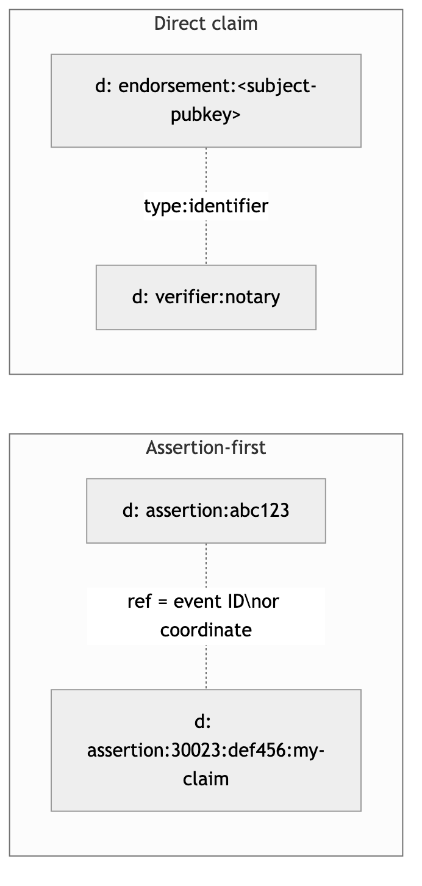
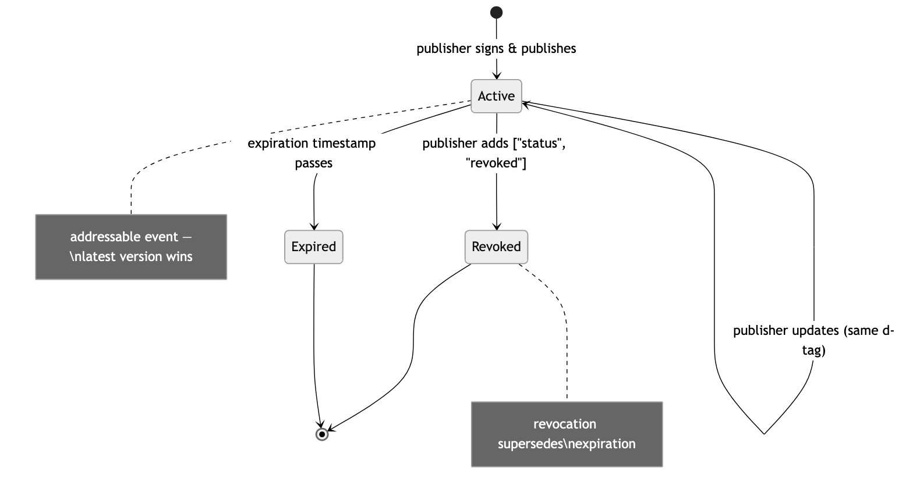

NIP-VA
======

Attestations
------------

`draft` `optional`

This NIP defines kind `31000`, an addressable event for attestations between Nostr identities. One kind serves credentials, endorsements, reviews, access grants, and any other attestation type — differentiated by a `type` tag or by reference to a first-person assertion event.

Motivation
----------

Several independent protocols on Nostr have converged on the same structural pattern: an addressable event where one pubkey makes a signed claim about another pubkey (or about itself). Each protocol invents its own event kind, leading to kind proliferation and missed interoperability. At least two independent proposals — one using kind 31000 with type-tag differentiation, another using kinds 31871–31873 with an assertion-first workflow — arrived at the same conclusion from different directions. This NIP incorporates lessons from both.

Existing NIPs partially address this space but leave significant gaps:

- [NIP-58](58.md) (Badges) is display-oriented — no structured claims, no expiration, no revocation.
- [NIP-85](85.md) (Trusted Assertions) covers computed social graph metrics, not arbitrary typed claims between identities.
- [NIP-32](32.md) (Labelling) provides lightweight, non-addressable labels. Labels are regular events with no mechanism to revoke a specific label without deleting the entire event.

A single generic attestation kind allows identity verification, professional licensing, product provenance, peer endorsement, and trust management to share a common event structure. Applications define their own semantics through the `type` tag and application-specific tags.

Specification
-------------

### Event Kind

Kind `31000` (Attestation) — an addressable event per [NIP-01](01.md). The number is unassigned in the official kind table and was chosen as a memorable, round number in the addressable range (30000–39999).

### Scope

This NIP defines the attestation **record format** only. It does not specify how attestations are requested, negotiated, or fulfilled. Workflow mechanics (who initiates an attestation, how requests are routed, how proficiency is declared) are application-defined and intentionally outside this spec.

Applications MAY use any workflow layer that suits their use case: automated issuance, user-initiated requests, DVM-based attestation services (NIP-90), or complex multi-step flows managed at the application layer. All of these can produce kind `31000` events as their output record.

Kind `31871` provides one such workflow layer, well-suited to event-verification scenarios with explicit request/response mechanics. Kind `31000` and kind `31871` are complementary: kind `31871` handles the workflow; kind `31000` is the record that workflow produces.

### Patterns

**Assertion-first (recommended).** The individual publishes their own claim as any Nostr event. The attestor validates it by referencing it via an `e` or `a` tag with the `"assertion"` marker. The type is inherited from the referenced event — no `type` tag is needed on the attestation. This pattern puts the individual at the centre: they own their claim, the attestor merely stamps it.

**Direct claim.** The attestor defines the `type` tag and makes a standalone claim. Used for endorsements, reviews, access grants, and any case where the attestor originates the claim rather than validating someone else's.

### Tags

#### Required

| Tag | Value | Description |
|-----|-------|-------------|
| `d` | `<type>:<identifier>` or `assertion:<ref>` | Addressable identifier (see [d-tag convention](#d-tag-convention)) |

At least one of `type` or an assertion reference MUST be present:

| Tag | Value | Condition |
|-----|-------|-----------|
| `type` | `<string>` | REQUIRED when no assertion reference is present. OPTIONAL when an assertion reference is present. MUST NOT contain colons. The value `assertion` is reserved and MUST NOT be used as a type value. |
| `e` | `<event-id>`, `<relay>`, `"assertion"` | Reference to the subject's assertion event (see [Assertion Marker](#assertion-marker)). |
| `a` | `<kind>:<pubkey>:<d-tag>`, `<relay>`, `"assertion"` | Reference to an addressable assertion event. |

At most one `e` or `a` tag with the `"assertion"` marker per event (never both). Plain `e`/`a` tags without the `"assertion"` marker are permitted for general event references and do not trigger assertion-first semantics.

When both `type` and an assertion reference are present, the `d` tag MUST use the assertion-first format (`assertion:<ref>`). The `type` tag serves as an explicit type override for filtering and display, but does not change d-tag construction.

#### Conditionally Required

| Tag | Value | Condition |
|-----|-------|-----------|
| `p` | `<subject-pubkey>` | REQUIRED for third-party claims. SHOULD be omitted for self-declarations. |

#### Recommended

| Tag | Value | Description |
|-----|-------|-------------|
| `expiration` | `<unix-timestamp>` | Per [NIP-40](40.md) |
| `summary` | `<human-readable>` | Display fallback for clients that do not understand the type |

#### Revocation

| Tag | Value | Required | Description |
|-----|-------|----------|-------------|
| `status` | `revoked` | Yes | Publisher withdraws the claim |
| `reason` | `<human-readable>` | No | Why it was revoked |

The `status` tag is used for lifecycle state. The only protocol-level value is `revoked`. Applications MAY define additional status values, but clients that do not understand a status value MUST treat the attestation as valid (non-revoked).

#### Custom Tags

Applications MAY define additional tags specific to their attestation types. Such tags are carried alongside the tags defined here.

The following application-level tags are used by the reference implementation and are documented here for interoperability. They are OPTIONAL and not part of the base protocol:

| Tag | Value | Description |
|-----|-------|-------------|
| `valid_from` | `<unix-timestamp>` | Deferred activation — attestation is not valid before this time |
| `valid_to` | `<unix-timestamp>` | Application-enforced validity end (distinct from NIP-40 `expiration`, which triggers relay-side deletion) |
| `occurred_at` | `<unix-timestamp>` | When the attested event occurred (distinct from `created_at`, which records when the attestation was published) |
| `schema` | `<URI>` | Machine-readable schema identifier for regulatory mapping or type disambiguation |
| `request` | `<event-reference>` | Reference to the event that prompted this attestation |

When both `valid_from` and `valid_to` are present, `valid_to` MUST be greater than `valid_from`.

#### Assertion Marker

This NIP introduces `"assertion"` as a new marker value for `e` and `a` tags, following the same positional convention as [NIP-10](10.md)'s `reply`, `root`, and `mention` markers. Using the existing `e`/`a` tag structure (rather than a new tag name) ensures that relay implementations already index these references — no relay changes are needed. The single new value is intentionally narrow: it marks exactly one referenced event as the subject's first-person claim being attested.

#### Discoverability Labels

Attestation publishers SHOULD include [NIP-32](32.md) labels for relay-side discoverability:

| Tag | Value | Condition |
|-----|-------|-----------|
| `L` | `nip-va` | Always |
| `l` | `<type-value>`, `nip-va` | When a `type` tag is present |

These labels allow clients to discover attestations via `{"#L": ["nip-va"]}` or filter by type via `{"#l": ["endorsement"]}` without relying on `d`-tag prefix matching.

### Content

Application-defined. MAY be empty, human-readable text, or JSON. Clients that do not understand the content SHOULD fall back to `summary`.

### d-tag Convention



**Assertion-first:** `assertion:<ref>`
- `<ref>` is the event ID (for `e`-tag assertions) or addressable coordinate (for `a`-tag assertions) being attested.
- Example: `assertion:abc123` or `assertion:30023:def456:my-claim`

**Direct claim:** `<type>:<identifier>`
- `<type>` matches the `type` tag value. MUST NOT contain colons. The first colon is the delimiter.
- `<identifier>` for third-party claims: typically the subject's hex pubkey.
- `<identifier>` for self-declarations: application-defined. Applications MUST document their identifier convention. When no application convention exists, the publisher's own hex pubkey is RECOMMENDED as a default to preserve the "one per publisher per type" guarantee.
- Example: `endorsement:abc123` or `verifier:notary`

Guarantees:

1. **One per publisher per claim.** Addressable semantics mean latest version wins.
2. **Relay-side filtering.** Query by `d`-tag prefix for all attestations of a type.
3. **No collisions.** Different types and assertion references occupy separate `d`-tag slots.

### Type Conventions

Generic type values (`credential`, `endorsement`, `vouch`, `provenance`, `verifier`) are shared vocabulary and SHOULD be used when the attestation fits a common meaning. Applications that need domain-specific types SHOULD prefix them with a reverse-domain namespace to avoid collision:

```
com.example:professional-licence
io.example:wallet-verification
```

Generic types without a namespace prefix are considered shared and any application MAY use them. Namespaced types are owned by the declaring application and carry application-specific semantics.

### Revocation

To revoke, the publisher replaces the original event with an updated version including `["status", "revoked"]`. Addressable event semantics mean the revocation supersedes the original.

Revocation uses status replacement rather than [NIP-09](09.md) deletion because deletion removes evidence that an attestation ever existed. A revoked attestation is a verifiable state — clients can display "this credential was revoked" with the publisher's reason, which is materially different from "no credential found." Deletion is also a request, not a guarantee; relays MAY ignore it. Status replacement is deterministic: the latest version of the addressable event is authoritative.

Clients MUST check for `status: revoked` before treating any attestation as valid.



### Verification Flow

```
1. Client queries: {"kinds": [31000], "#p": ["<subject>"]}
2. For each event: check status != revoked
3. Check expiration not passed (NIP-40)
4. If assertion-first (e/a tag with "assertion" marker):
   a. Fetch the referenced assertion event from relay hint
   b. Verify the assertion event exists and is authored by the subject
   c. If the referenced event cannot be found, treat the attestation
      as unverifiable (client MAY display with a warning)
5. Evaluate publisher trust (web-of-trust)
6. Parse application-specific tags
```

### Self-attestation Discovery

Self-attestations have no `p` tag. To discover them, clients SHOULD use NIP-32 labels:

```json
{"kinds": [31000], "authors": ["<pubkey>"], "#L": ["nip-va"]}
```

This returns all attestations by the pubkey. Clients filter client-side by `type` tag or d-tag prefix for specific attestation types.

Where a relay supports `d`-tag prefix matching, a more precise query is possible:

```json
{"kinds": [31000], "authors": ["<pubkey>"], "#d": ["verifier:"]}
```

Clients MUST NOT rely on prefix matching alone, as relay support varies.

Examples
--------

### Assertion-first (individual at the centre)

A verifier attests to the validity of a subject's own claim:

```json
{
  "id": "<32-bytes-hex>",
  "kind": 31000,
  "pubkey": "<verifier-pubkey>",
  "created_at": 1711500000,
  "tags": [
    ["d", "assertion:<subject-event-id>"],
    ["e", "<subject-event-id>", "wss://relay.example.com", "assertion"],
    ["p", "<subject-pubkey>"],
    ["L", "nip-va"],
    ["summary", "Identity claim verified in person"]
  ],
  "content": "",
  "sig": "<64-bytes-hex>"
}
```

The `"assertion"` marker on the `e` tag distinguishes this from a generic event reference. The type is determined by the referenced assertion event.

### Direct claim (endorsement)

One identity endorses another based on direct experience:

```json
{
  "id": "<32-bytes-hex>",
  "kind": 31000,
  "pubkey": "<endorser-pubkey>",
  "created_at": 1711500000,
  "tags": [
    ["d", "endorsement:<subject-pubkey>"],
    ["type", "endorsement"],
    ["p", "<subject-pubkey>"],
    ["L", "nip-va"],
    ["l", "endorsement", "nip-va"],
    ["summary", "Reliable provider, completed 12 transactions"]
  ],
  "content": "",
  "sig": "<64-bytes-hex>"
}
```

### Revocation

The original publisher withdraws a previously issued endorsement:

```json
{
  "id": "<32-bytes-hex>",
  "kind": 31000,
  "pubkey": "<endorser-pubkey>",
  "created_at": 1711600000,
  "tags": [
    ["d", "endorsement:<subject-pubkey>"],
    ["type", "endorsement"],
    ["p", "<subject-pubkey>"],
    ["L", "nip-va"],
    ["l", "endorsement", "nip-va"],
    ["status", "revoked"],
    ["reason", "fraudulent activity detected"]
  ],
  "content": "",
  "sig": "<64-bytes-hex>"
}
```

### Assertion-first with explicit type (hybrid)

The attestor references a first-person assertion and adds an explicit type for relay-side filtering:

```json
{
  "id": "<32-bytes-hex>",
  "kind": 31000,
  "pubkey": "<verifier-pubkey>",
  "created_at": 1711500000,
  "tags": [
    ["d", "assertion:<subject-event-id>"],
    ["e", "<subject-event-id>", "wss://relay.example.com", "assertion"],
    ["type", "credential"],
    ["p", "<subject-pubkey>"],
    ["L", "nip-va"],
    ["l", "credential", "nip-va"],
    ["summary", "Professional licence verified"]
  ],
  "content": "",
  "sig": "<64-bytes-hex>"
}
```

The `type` tag enables `#type` queries while the `d` tag uses the assertion-first format.

Relay Queries
-------------

```json
// All attestations about a subject
{"kinds": [31000], "#p": ["<subject-pubkey>"]}

// All attestations by a specific issuer
{"kinds": [31000], "authors": ["<issuer-pubkey>"]}

// All attestations of a specific type (via NIP-32 label)
{"kinds": [31000], "#l": ["endorsement"]}

// Specific attestation (revocation check)
{"kinds": [31000], "authors": ["<issuer-pubkey>"], "#d": ["endorsement:<subject-pubkey>"]}
```

Note: Type-based queries use NIP-32 label filters (`#l`) rather than `#type`, because relay implementations reliably index `l` tags but MAY not index arbitrary custom tags.

Security Considerations
-----------------------

### Attestation Forgery

Requires key compromise. Clients SHOULD evaluate attestations by publisher trust, not treat any as inherently authoritative.

### Sybil Farming

Free keypairs mean free attestations. Defence: web-of-trust filtering per [NIP-02](02.md). Weight by social distance, not count. A single attestation from a followed pubkey is worth more than a thousand from unknown keys.

### Replay Across Contexts

The `type` and `d`-tag bind attestations to a specific context. An `endorsement` cannot be misinterpreted as a `credential`.

### Privacy

The `p` tag reveals the subject. For sensitive attestations, publishers SHOULD use [NIP-59](59.md) gift wrapping for private delivery.

### Relay Censorship

A relay can hide revocations. Clients MUST query multiple relays. Treat as revoked if ANY relay returns the revocation.

### Type Squatting

Attacker uses well-known type values with misleading semantics. Applications SHOULD use application-specific tags (e.g. schema URIs) for machine-readable disambiguation.

Relationship to Existing NIPs
-----------------------------

| Existing | Relationship |
|----------|-------------|
| [NIP-32](32.md) (Labels) | Labels (kind `1985`) are **regular** events. Attestations (kind `31000`) are **addressable** events. This creates four structural differences: (1) Labels have no "latest version wins" — a query returns every label ever published, not the current state. Attestations replace in-place: one event per publisher per d-tag. (2) Labels cannot be individually revoked — deleting a label event ([NIP-09](09.md)) removes all labels in that event, not a specific one. Attestations support granular revocation via `["status", "revoked"]` on the specific d-tag. (3) Labels have no scoped d-tag — there is no way to query "the current label from pubkey X about subject Y of type Z." Attestation d-tags (`<type>:<identifier>` or `assertion:<ref>`) give exactly this. (4) Labels carry no temporal validity — no expiration, no validity windows, no lifecycle. Attestations compose with [NIP-40](40.md) expiration and support status-based lifecycle. Labels are observations; attestations are living, updatable, revocable claims. |
| [NIP-58](58.md) (Badges) | Badges are display-oriented — no structured claims, no expiration, no revocation. Attestations carry typed, structured, revocable claims. |
| [NIP-85](85.md) (Trusted Assertions) | NIP-85 outputs computed metrics. Attestations record human claims. NIP-85 is downstream — it can ingest attestations as input data. |
| Kind 31871 (Community NIP) | Kind 31871 pioneered the assertion-first philosophy: the individual publishes their own claim, and third parties attest to it rather than making independent statements about them. NIP-VA incorporates this pattern directly — the `"assertion"` marker and assertion-first d-tag format are a direct expression of that philosophy. Kind 31871 also defines explicit workflow mechanics (request, recommendation, proficiency declaration) suited to event-verification scenarios where strangers need to coordinate. NIP-VA focuses on the attestation record itself and leaves workflow to the application layer, making it a natural complement: kind 31871 handles the coordination, kind 31000 records the outcome. The two address different layers of the same problem. |
| NIP-91 / Service Attestations (38383–38384) | NIP-91 was closed and redirected to NIP-32. Service Attestations (kinds 38383–38384) address a narrower scope: service completion attestations with Namecoin anchoring. NIP-VA subsumes the attestation primitive (a signed claim about a pubkey) while leaving domain-specific features like blockchain anchoring to application profiles built on top. |
| TSM Assertion Services (37574–37576) | TSM assertions are computed outputs from trust service machines — algorithmic WoT scores, not human-originated claims. NIP-VA records first-person or third-party claims. The two are complementary: TSM services could ingest NIP-VA attestations as input signals for trust computation. |
| Agent Reputation Attestations (PR #2285, kind 30085) | Proposes structured reputation scoring specifically for AI agents. NIP-VA provides the general attestation layer (a signed claim about a pubkey); agent-specific scoring algorithms are application logic that can be expressed as NIP-VA attestation content or application-specific tags. |
| NIP-A1 Testimonials (PR #2198) | Proposes user endorsements via gift-wrapped signed events. NIP-VA's `endorsement` type covers the same use case with addressable semantics — endorsements are publicly discoverable, individually revocable, and queryable by relay filters, while gift-wrapped testimonials are private by default. The two serve different privacy models. |

HTTP Discovery (Informational)
------------------------------

Services running with NIP-VA provenance attestations MAY advertise them over HTTP using these conventions. This section is informational — not a protocol requirement.

### Response Header

    X-Nostr-Attestation: <hex-event-id>

Every HTTP response from an attested service includes this header. For direct attestations, the value is the attestation event ID. For assertion-first attestations, the value is the assertion event ID. The well-known endpoint disambiguates.

### Well-Known Endpoint

`GET /.well-known/nostr-attestation.json` returns a JSON object describing the service's attestation.

**Direct pattern** — the attestation is a first-party claim by an authority:

```json
{
  "pattern": "direct",
  "event_id": "<hex-event-id>",
  "relays": ["wss://relay.example.com"],
  "verify": "https://njump.me/nevent1..."
}
```

Verification: fetch the event by ID from a listed relay, verify the signature, parse with a NIP-VA library.

**Assertion-first pattern** — the service published a self-declaration, third parties attest to it:

```json
{
  "pattern": "assertion-first",
  "assertion_id": "<hex-assertion-event-id>",
  "relays": ["wss://relay.example.com"],
  "verify": "https://njump.me/nevent1..."
}
```

Verification: fetch the assertion event, then query for kind `31000` events with `#e` filter matching the assertion ID. Each result is a third-party attestation. Trust depends on who attested (web of trust), not how many.

| Field | Type | Required | Description |
|-------|------|----------|-------------|
| `pattern` | `"direct"` \| `"assertion-first"` | Yes | Verification flow |
| `event_id` | hex string | Direct only | Attestation event ID |
| `assertion_id` | hex string | Assertion-first only | Self-declaration event ID |
| `relays` | string[] | Yes | Relay URLs for fetching |
| `verify` | URL | No | Human-readable verification link |

Responses SHOULD include `Cache-Control: public, max-age=3600`. The attestation changes only on deploy.

Implementation Evidence
-----------------------

This pattern emerged independently across six application domains before the NIP was drafted: identity verification (attestation types with ring signature proofs), professional licensing (regulatory credentials), service reputation (bilateral endorsements), product provenance (chain of custody), trust networks (peer endorsement graphs), and wallet verification (build reproducibility). Two independent reference implementations exist with a combined 150+ tests and 20 frozen conformance vectors.

Known Limitations
-----------------

**Multi-party attestation.** Kind `31000` represents a single attestor's claim. Scenarios requiring consensus from multiple attestors (e.g. N-of-M credential approval) are not modelled at the protocol level. Applications requiring multi-party consensus SHOULD aggregate multiple kind `31000` events and apply their own threshold logic. Applications that require cryptographic multi-party proof without revealing individual signers MAY use ring signatures in the `content` field. A future extension may standardise threshold aggregation patterns.

Backwards Compatibility
-----------------------

This NIP introduces a new event kind. No existing events are affected. Clients that do not understand kind `31000` will ignore these events per [NIP-01](01.md) semantics.
